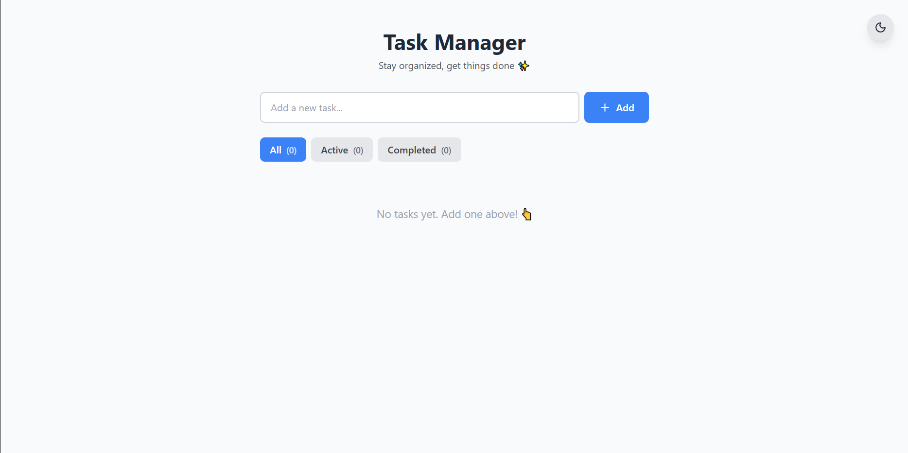
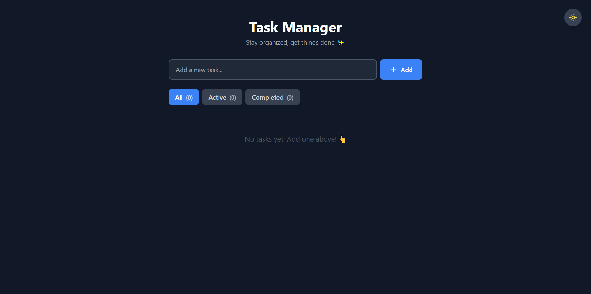
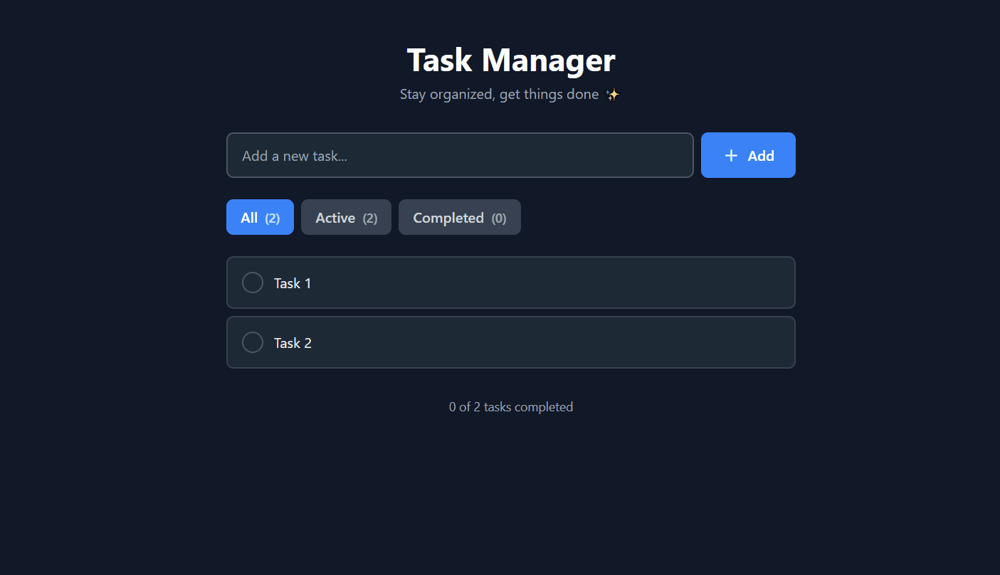

# 📝 Ứng Dụng Quản Lý Công Việc

Ứng dụng quản lý công việc hiện đại, đầy đủ tính năng được xây dựng bằng React, TypeScript và Tailwind CSS.


## ✨ Tính Năng

- ✅ **Thêm, sửa và xóa công việc** - Đầy đủ các thao tác CRUD
- ✅ **Đánh dấu hoàn thành** - Theo dõi tiến độ công việc
- ✅ **Kéo thả để sắp xếp** - Tổ chức công việc theo ý muốn
- ✅ **Lọc theo trạng thái** - Xem tất cả/đang làm/đã hoàn thành
- ✅ **Chế độ tối** - Bảo vệ mắt khi sử dụng
- ✅ **Lưu trữ bền vững** - Dữ liệu được lưu trong localStorage
- ✅ **Responsive hoàn toàn** - Hoạt động trên mọi thiết bị
- ✅ **Hiệu ứng mượt mà** - Trải nghiệm người dùng thú vị

## 🚀 Demo Trực Tuyến

👉 **[Xem Demo](https://task-manager-ebon-eight-60.vercel.app)**

## 🛠️ Công Nghệ Sử Dụng

- **React 19** - Thư viện UI
- **TypeScript** - Đảm bảo type safety
- **Tailwind CSS 3** - Framework CSS
- **@hello-pangea/dnd** - Thư viện kéo thả
- **Lucide React** - Bộ icon đẹp
- **Vite** - Build tool

## 💻 Bắt Đầu

### Yêu Cầu
- Node.js 20+ 
- npm hoặc yarn

### Cài Đặt
```bash
# Clone repository
git clone https://github.com/nbv9704/task-manager.git
cd task-manager

# Cài đặt dependencies
npm install

# Chạy development server
npm run dev

# Build cho production
npm run build
```

## 📸 Ảnh Chụp Màn Hình

### Light Mode


### Dark Mode


### Drag & Drop


## 🎯 Kiến Thức Đạt Được

### 1. Quản Lý State
- Custom hooks để tái sử dụng logic (`useLocalStorage`, `useTheme`)
- Cập nhật state hiệu quả với immutability
- Tối ưu hiệu năng với `useMemo`

### 2. TypeScript Best Practices
- Typing chặt chẽ với interfaces
- Type-safe event handlers
- Generic custom hooks

### 3. Triển Khai Drag & Drop
- Tích hợp thư viện @hello-pangea/dnd
- Sắp xếp mượt mà với phản hồi trực quan
- Lưu trữ thứ tự trong localStorage

### 4. Trải Nghiệm Người Dùng
- Animations và transitions mượt mà
- Hiệu ứng hover trực quan
- Thiết kế responsive cho mọi kích thước màn hình
- Hỗ trợ điều hướng bằng bàn phím

## 🔮 Tính Năng Tương Lai

- [ ] Chỉnh sửa công việc (double-click để sửa)
- [ ] Phân loại và gắn thẻ
- [ ] Ngày đến hạn và nhắc nhở
- [ ] Tính năng tìm kiếm
- [ ] Xuất/nhập dữ liệu
- [ ] Tích hợp backend
- [ ] Hỗ trợ nhiều người dùng

## 👨‍💻 Tác Giả

**Ngô Bảo Việt**
- GitHub: [@nbv9704](https://github.com/nbv9704)
- Email: ngobaoviet97@gmail.com

## 📄 Giấy Phép

Dự án này là mã nguồn mở và có sẵn theo [Giấy phép MIT](LICENSE).

---

## 🌟 Đóng Góp

Mọi đóng góp đều được chào đón! Vui lòng tạo Pull Request hoặc mở Issue nếu bạn có ý tưởng cải thiện.
